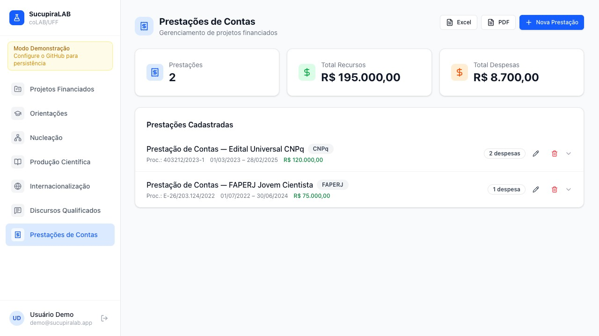
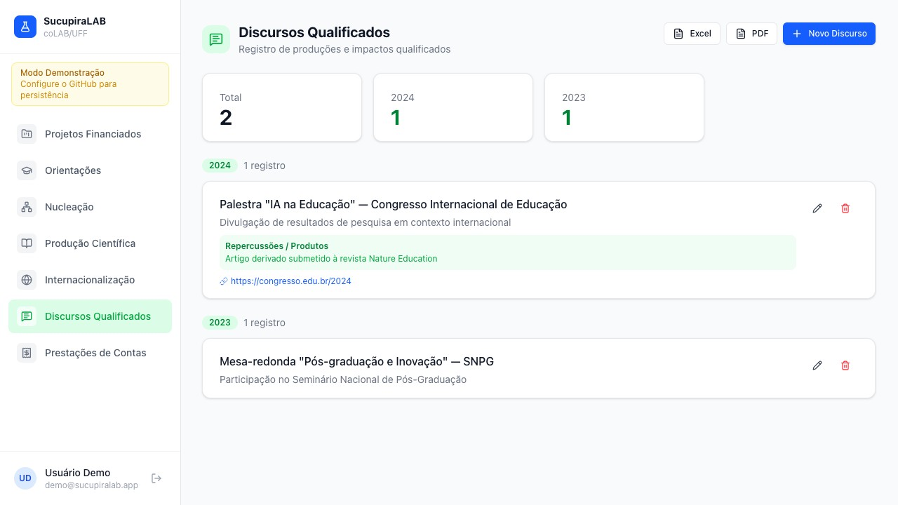
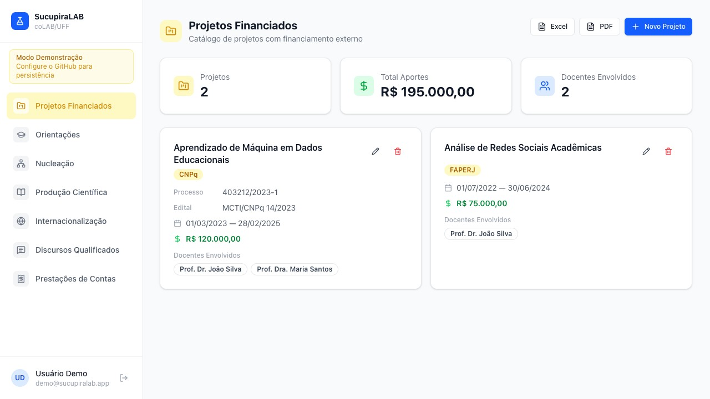
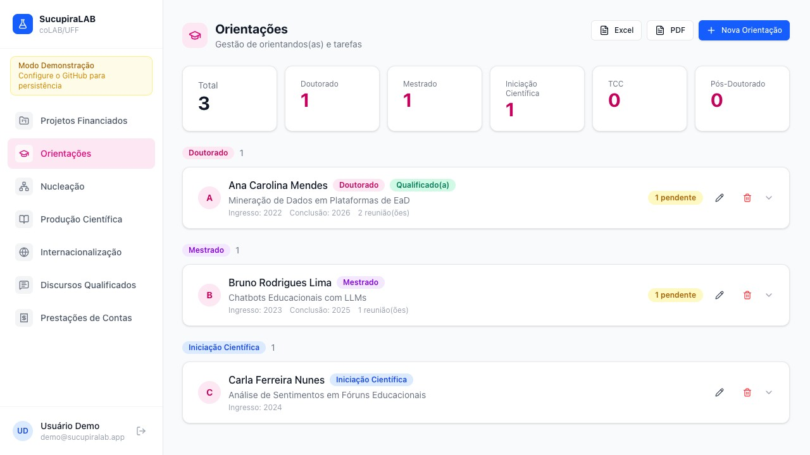
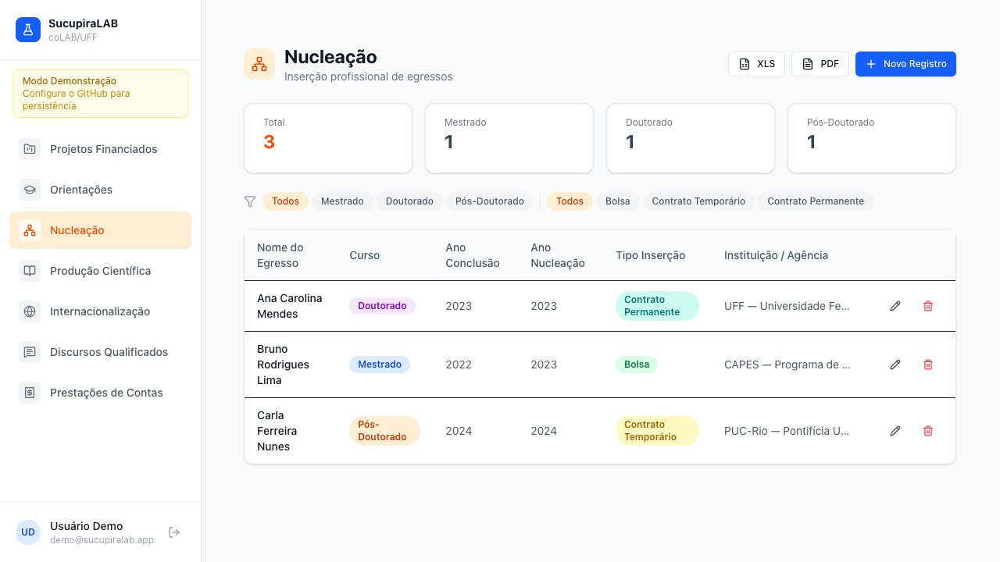
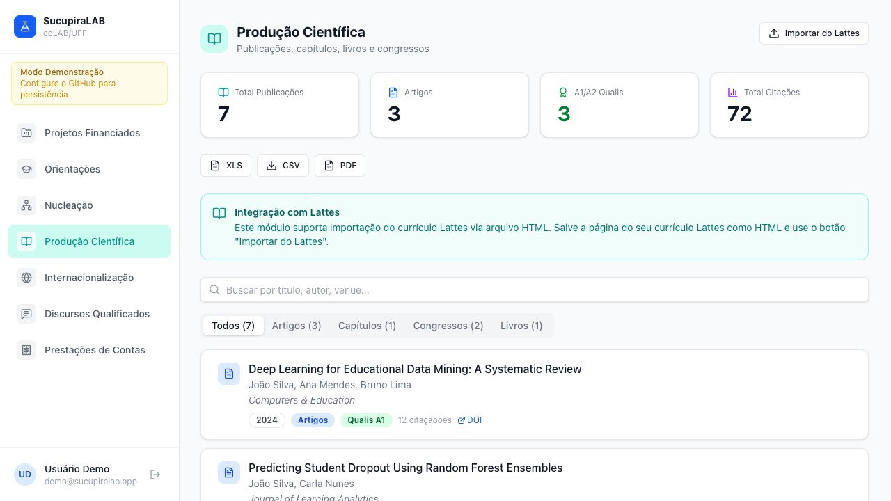
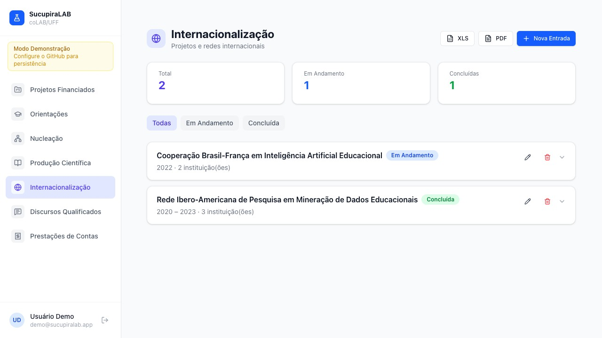

# :pencil2: SucupiraLAB

[](https://doi.org/10.5281/zenodo.19434100)

O SucupiraLAB é uma aplicação web de gestão acadêmica voltada para pesquisadores, docentes e coordenadores de pós-graduação, e projetada para organizar e acompanhar as atividades de rotina de gestão de projetos de pesquisa exigidas, incluindo dados colhidos para alimentar a Plataforma Sucupira da CAPES. Por meio de uma interface moderna, o sistema permite gerenciar prestações de contas com despesas e documentos comprobatórios em anexo, discursos qualificados, importação e tabulação da produção científica, projetos financiados, orientações de alunos com controle de tarefas, nucleação de egressos e atividades de internacionalização — tudo com geração de relatórios em PDF e exportação para planilhas. Diferentemente de soluções tradicionais, o SucupiraLAB não utiliza banco de dados próprio: todos os dados são armazenados diretamente em um repositório GitHub privado do próprio usuário, garantindo total controle, privacidade e portabilidade das informações.

O software foi desenvolvido por [Viktor Chagas](https://scholar.google.com/citations?user=F02DKoAAAAAJ&hl=en) e pelo [coLAB/UFF](http://colab-uff.github.io), com auxílio do Claude Code Sonnet 4.6 para as tarefas de programação. Os autores agradecem a Rafael Cardoso Sampaio pelos comentários e sugestões de adoção de ferramentas de IA, que levaram ao planejamento inicial da aplicação.

# :octocat: Frameworks

O SucupiraLAB foi desenvolvido em TypeScript com React 19 como framework de interface, utilizando Vite 7 como bundler e servidor de desenvolvimento. A estilização é feita com Tailwind CSS v4 (via plugin oficial para Vite). Para roteamento foi utilizado React Router v7 com rotas aninhadas, e o gerenciamento de dados assíncronos é feito com TanStack Query v5. Os componentes de interface seguem o padrão shadcn/ui, construídos sobre primitivos Radix UI com utilitários cva, clsx e tailwind-merge. Recursos adicionais incluem Recharts para gráficos, jsPDF + jspdf-autotable para exportação em PDF, xlsx para planilhas e js-yaml para serialização dos dados.

A persistência de dados ocorre diretamente no repositório GitHub do usuário por meio da GitHub Contents API (REST), sem banco de dados externo. Os dados são armazenados em arquivos YAML e anexos em base64, organizados por entidade no repositório. O projeto não depende de nenhum serviço de backend próprio — o navegador se comunica diretamente com a API do GitHub.

---

## :gem: Módulos

### 1. Prestações de Contas

Acompanhe, registre e organize a prestação de contas de projetos e financiamentos. Este módulo permite arquivar documentos comprobatórios, controlar prazos e monitorar as despesas de projetos financiados por agências de fomento.




### 2. Discursos Qualificados

Sistematize e descreva produtos e pesquisas de alto impacto social, discursos, palestras, conferências, relatórios ou participações públicas que tenham relevância social, política ou institucional. O módulo permite documentar contexto, público, data e materiais associados.




### 3. Projetos Financiados

Cadastre e descreva o financiamento obtido com projetos de pesquisa. O módulo reúne informações sobre editais, agências financiadoras, cronogramas, valores concedidos e equipe envolvida, para que você tenha sempre um histórico atualizado desses dados.




### 4. Orientações em Andamento

Registre orientandos(as), níveis de formação, temas de pesquisa, etapas do trabalho e prazos relevantes. Ferramenta para acompanhar atividades de orientação acadêmica, incluindo um diário de reuniões de orientação e indicações de leitura.




### 5. Nucleação

Documente a inserção profissional de egressos do programa ou sob sua orientação: mestres, doutores e pós-doutores que foram absorvidos por instituições públicas ou privadas, ou contemplados com bolsas de fomento.




### 6. Produção Científica

Catalogue e organize sua produção acadêmica, como artigos, capítulos, livros e trabalhos em eventos. Facilita o acompanhamento de publicações, coautorias e veículos de divulgação científica. O módulo importa diretamente da sua página no Lattes os dados, basta que você salve o seu currículo como um arquivo HTML.




### 7. Internacionalização

Catalogue projetos e atividades de cooperação internacional do programa ou que você integra: parcerias com instituições estrangeiras, editais, financiamentos e equipes envolvidas.



---

# 🚀 Instalação do SucupiraLAB — Passo a passo

> Toda a configuração é feita pelo navegador e pela interface do GitHub.
> Nenhum terminal, nenhum build local — o GitHub cuida de tudo automaticamente.


---

## Passo 1 — Fork do repositório

1. Acesse **github.com/ombudsmanviktor/sucupiralab**
2. Clique em **Fork** (canto superior direito)
3. Escolha sua conta como destino e confirme

Você terá uma cópia em `github.com/SEU-USUARIO/sucupiralab`.

---

## Passo 2 — Ativar o GitHub Pages

1. No seu fork, acesse **Settings → Pages**
2. Em **Source**, selecione **GitHub Actions**
3. Salve

O GitHub irá executar o workflow automaticamente e publicar o app. Aguarde cerca de 1–2 minutos e acesse:

```
https://SEU-USUARIO.github.io/sucupiralab
```

> Você pode acompanhar o progresso em **Actions** → workflow "Build e deploy no GitHub Pages".

---

## Passo 3 — Criar o repositório de dados

O SucupiraLAB armazena seus dados em YAML num repositório GitHub **privado** de sua propriedade.

1. Acesse **github.com → New repository**
2. Deixe o repositório **privado**
3. Marque **"Add a README file"** (para inicializar o branch `main`)
4. Anote o nome do repositório criado

---

## Passo 4 — Gerar um Personal Access Token (PAT)

1. Acesse **github.com → Settings → Developer settings → Personal access tokens → Tokens (classic)**
2. Clique em **Generate new token (classic)**
3. Selecione o escopo **`repo`**
4. Clique em **Generate token** e copie o valor (`ghp_...`)

> ⚠️ O token é exibido apenas uma vez. Guarde-o em local seguro.

---

## Passo 5 — Configurar o login

Acesse `https://SEU-USUARIO.github.io/sucupiralab` e preencha:

- **Personal Access Token** — o valor copiado no Passo 4
- **Usuário / Org** — seu nome de usuário no GitHub
- **Repositório** — nome do repositório criado no Passo 3
- **Branch** — `main` (padrão)

Clique em **Conectar e entrar**.

---

## Login com Google (opcional)

Para habilitar o login com Google, edite o arquivo `public/config.json` no seu fork e preencha os campos do bloco `firebase` com as credenciais do seu projeto Firebase. O commit acionará um novo deploy automaticamente.

Deixe os campos em branco para usar apenas o modo PAT — o app funciona normalmente sem Firebase.

---

## Instalação local (desenvolvimento)

Se preferir rodar o app localmente:

```bash
git clone https://github.com/SEU-USUARIO/sucupiralab.git
cd sucupiralab
npm install
npm run dev        # http://localhost:5173
```

---

## Estrutura de dados

Os dados são salvos no repositório GitHub configurado no login:

```
data/
  prestacoes/          ← Prestações de Contas
  discursos/           ← Discursos Qualificados
  projetos/            ← Projetos Financiados
  orientacoes/         ← Orientações
  producao/            ← Produção Científica
  nucleacoes/          ← Nucleação
  internacionalizacao/ ← Internacionalização
attachments/           ← Anexos (base64 via API)
```

> Cada registro é um arquivo `.yaml` independente, editável diretamente pelo GitHub se necessário.

---

*SucupiraLAB — App de gestão acadêmica · um projeto desenvolvido por [coLAB/UFF](https://colab-uff.github.io/)*
