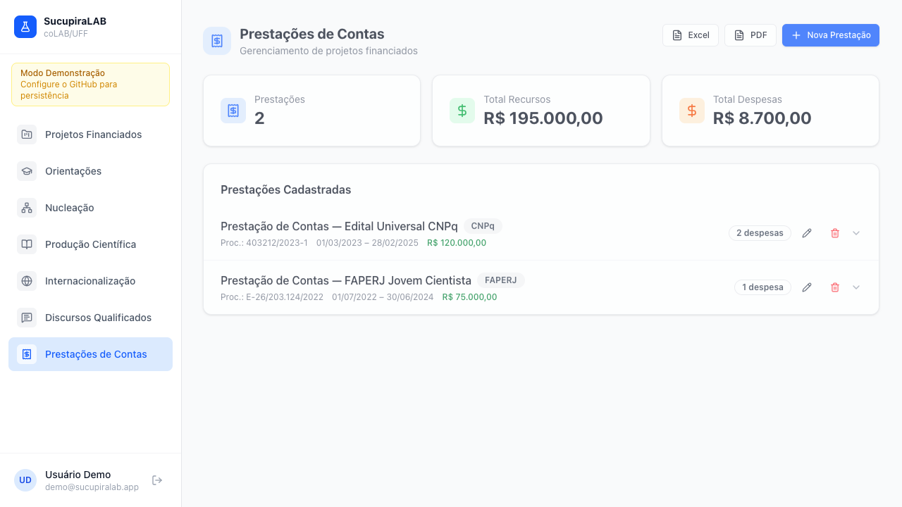

# :pencil2: SucupiraLAB

O SucupiraLAB é uma aplicação web de gestão acadêmica voltada para pesquisadores, docentes e coordenadores de pós-graduação, e projetada para organizar e acompanhar as atividades de rotina de gestão de projetos de pesquisa exigidas, incluindo dados colhidos para alimentar a Plataforma Sucupira da CAPES. Por meio de uma interface moderna, o sistema permite gerenciar prestações de contas com despesas e documentos comprobatórios em anexo, discursos qualificados, importação e tabulação da produção científica, projetos financiados, orientações de alunos com controle de tarefas, e monitoramento do fluxo de submissões de artigos em formato kanban — tudo com geração de relatórios em PDF e exportação para planilhas. Diferentemente de soluções tradicionais, o SucupiraLAB não utiliza banco de dados próprio: todos os dados são armazenados diretamente em um repositório GitHub privado do próprio usuário, garantindo total controle, privacidade e portabilidade das informações.

O software foi desenvolvido por [Viktor Chagas](https://scholar.google.com/citations?user=F02DKoAAAAAJ&hl=en) e pelo [coLAB/UFF](http://colab-uff.github.io), com auxílio do Claude Code Sonnet 4.6 para as tarefas de programação. Os autores agradecem a Rafael Cardoso Sampaio pelos comentários e sugestões de adoção de ferramentas de IA, que levaram ao planejamento inicial da aplicação.

# :octocat: Frameworks

O SucupiraLAB foi desenvolvido em TypeScript com React 19 como framework de interface, utilizando Vite 7 como bundler e servidor de desenvolvimento. A estilização é feita com Tailwind CSS v4 (via plugin oficial para Vite). Para roteamento foi utilizado React Router v7 com rotas aninhadas, e o gerenciamento de dados assíncronos é feito com TanStack Query v5. Os componentes de interface seguem o padrão shadcn/ui, construídos sobre primitivos Radix UI com utilitários cva, clsx e tailwind-merge. Recursos adicionais incluem @hello-pangea/dnd para drag-and-drop no kanban, Recharts para gráficos, jsPDF + jspdf-autotable para exportação em PDF, xlsx para planilhas e js-yaml para serialização dos dados.

A autenticação é feita via Firebase Authentication (Google OAuth), e toda a persistência de dados ocorre diretamente no repositório GitHub do usuário por meio da GitHub Contents API (REST), sem banco de dados externo. Os dados são armazenados em arquivos YAML e anexos em base64, organizados por entidade no repositório. O projeto não depende de nenhum serviço de backend próprio — o navegador se comunica diretamente com as APIs do GitHub e do Firebase.

# 🚀 Instalação do SucupiraLAB — Passo a passo

> Toda a configuração é feita pelo navegador e pela interface do GitHub.
> Nenhum terminal, nenhum build local — o GitHub cuida de tudo automaticamente.


---

## Passo 1 — Fork do repositório no GitHub

1. Acesse [github.com](https://github.com) com sua conta
2. Vá ao repositório do SucupiraLAB e clique em **Fork** (ou suba os arquivos em um repositório novo)
3. O repositório pode ser **público ou privado**

---

## Passo 2 — Ativar o GitHub Pages

1. No repositório forkado: **Settings → Pages**
2. Em "Source", selecione **GitHub Actions**
3. Salve — nada mais a fazer aqui

---

## Passo 3 — Criar um repositório de dados no GitHub

1. Crie um segundo repositório **privado** (ex: `meus-dados-sucupira`) — é onde os seus dados YAML serão salvos
2. Não precisa de nenhum arquivo dentro, pode ficar vazio

---

## Passo 4 — Obter um PAT do GitHub (feito pelo navegador)

1. GitHub → **Settings → Developer settings → Personal access tokens → Tokens (classic)**
2. Clique **Generate new token**
3. Marque o escopo **`repo`**
4. Gere e copie o token — você vai colá-lo no app mais tarde

---

## Passo 5A — (Opcional) Configurar login com Google

Se quiser o botão "Entrar com Google", edite o arquivo `public/config.json` direto no GitHub
(clique no arquivo → ícone de lápis ✏️):

```json
{
  "_instrucoes": "Preencha os campos abaixo com as credenciais do seu projeto Firebase",
  "firebase": {
    "apiKey": "AIza...",
    "authDomain": "seu-projeto.firebaseapp.com",
    "projectId": "seu-projeto",
    "storageBucket": "seu-projeto.firebasestorage.app",
    "messagingSenderId": "123456789",
    "appId": "1:123:web:abc..."
  }
}
```

### Para criar o projeto Firebase:

1. Acesse [console.firebase.google.com](https://console.firebase.google.com) → **Criar projeto**
2. **Authentication → Sign-in method → Google → Ativar**
3. **Project settings → Your apps → Web app** (ícone `</>`) → copie o `firebaseConfig`
4. Em **Authentication → Settings → Authorized domains** → adicione `SEU-USUARIO.github.io`

> Se não quiser Google Auth, deixe o `config.json` com os campos em branco — o app funcionará com PAT + GitHub direto.

---

## Passo 5B — (Opcional) Criar o OAuth App no GitHub

1. Acesse github.com → Settings → Developer settings → OAuth Apps → New OAuth App

2. Preencha:

Application name: SucupiraLAB (ou outro nome)
Homepage URL: URL do seu app (ex: https://sucupiralab.ombudsmanviktor.me)
Authorization callback URL: pode deixar a mesma URL do Homepage — não é usada no Device Flow

3. Clique em Register application

Na tela do app criado, role até Device Authorization e ative o toggle "Enable Device Flow"
Copie o Client ID exibido (começa com Iv1.)
⚠️ Não é necessário gerar Client Secret — o Device Flow para apps públicos usa apenas o Client ID.

### Configurar o config.json

No arquivo public/config.json do repositório da aplicação, preencha o campo clientId:

{
  "github_oauth": {
    "clientId": "Iv1.xxxxxxxxxxxxxxxxx"
  }
}

Após salvar e republicar o app, o botão "Entrar com GitHub" aparecerá automaticamente na tela de login.

Como funciona para o usuário:

1. Clica em Entrar com GitHub
2. O app exibe um código curto (ex: ABCD-1234)
3. O usuário acessa github.com/login/device em qualquer browser, digita o código e clica em Authorize
4. O app recebe o token automaticamente — sem digitar PAT
5. Na primeira vez, informa o repositório de dados (owner/repo); nas próximas, entra direto

### Mantendo o login com PAT

Se preferir não configurar o OAuth (deixar clientId em branco), a tela de login mostrará apenas o formulário PAT — o comportamento atual, sem alterações. Quando o OAuth está ativo, o formulário PAT continua acessível via toggle "Configurar com PAT" na tela de login.


## Passo 6 — Fazer o deploy (automático)

Qualquer commit/push na branch `main` do repositório dispara o **GitHub Actions** automaticamente, que:

1. Instala as dependências (`npm ci`)
2. Compila o projeto (`npm run build`)
3. Publica no GitHub Pages

O primeiro deploy demora ~2 minutos. Você pode acompanhar em:
**Actions → Build e Deploy no GitHub Pages**

---

## Passo 7 — Primeiro acesso ao site

1. Acesse: `https://SEU-USUARIO.github.io/NOME-DO-REPO/`
2. Se configurou Firebase: clique **Entrar com Google**
3. Se não configurou: use o formulário de PAT direto
4. Preencha:
   - **PAT**: o token gerado no Passo 4
   - **Usuário/Org**: seu usuário GitHub
   - **Repositório**: `meus-dados-sucupira` (criado no Passo 3)
5. Clique **Conectar e entrar** — pronto! ✅

> Os dados são salvos como arquivos YAML no seu repositório privado.
> Cada usuário que logar com uma conta Google diferente terá acesso apenas aos seus próprios dados.



---

## Módulos

### 1. Prestações de Contas

Acompanhe, registre e organize a prestação de contas de projetos e financiamentos. Este módulo permite arquivar documentos comprobatórios, controlar prazos e monitorar as despesas de projetos financiados por agências de fomento.


   
### 2. Projetos Financiados

Cadastre e descreva o financiamento obtido com projetos de pesquisa. O módulo reúne informações sobre editais, agências financiadoras, cronogramas, valores concedidos e equipe envolvida, para que você tenha sempre um histórico atualizado desses dados.


### 3. Orientações em Andamento

Registre orientandos(as), níveis de formação, temas de pesquisa, etapas do trabalho e prazos relevantes. Ferramenta para acompanhar atividades de orientação acadêmica, incluindo um diário de reuniões de orientação e indicações de leitura.


### 4. Nucleação

Documente a inserção profissional de egressos do programa ou sob sua orientação: mestres, doutores e pós-doutores que foram absorvidos por instituições públicas ou privadas, ou contemplados com bolsas de fomento.


### 5. Produção Científica

Catalogue e organize sua produção acadêmica, como artigos, capítulos, livros e trabalhos em eventos. Facilita o acompanhamento de publicações, coautorias e veículos de divulgação científica. O módulo importa diretamente da sua página no Lattes os dados, basta que você salve o seu currículo como um arquivo HTML.


### 6. Internacionalização

Catalogue projetos e atividades de cooperação internacional do programa ou que você integra: parcerias com instituições estrangeiras, editais, financiamentos e equipes envolvidas.


### 7. Discursos Qualificados

Sistematize e descreva produtos e pesquisas de alto impacto social, discursos, palestras, conferências, relatórios ou participações públicas que tenham relevância social, política ou institucional. O módulo permite documentar contexto, público, data e materiais associados.


### 8. Fluxo e Follow-Up de Submissões

Monitore e acompanhe suas submissões de manuscritos a periódicos ou eventos, registrando cada etapa de revisão, decisões editoriais e o histórico de versões e comunicações entre autores e editores. Sistema de acompanhamento do ciclo de submissão de trabalhos acadêmicos. 


---

## Estrutura de dados criada automaticamente

```
meus-dados-sucupira/
├── data/
│   ├── prestacoes/       ← Prestações de Contas (.yaml por entrada)
│   ├── discursos/        ← Discursos Qualificados
│   ├── projetos/         ← Projetos Financiados
│   ├── orientacoes/      ← Orientações (inclui tarefas, reuniões, leituras)
│   ├── producao/         ← Produção Científica
│   └── submissoes/       ← Submissões (inclui eventos do kanban)
└── attachments/          ← Anexos enviados via app (base64)
```

---

## Modos de operação

| Modo | Quando ocorre | Persistência |
|------|--------------|--------------|
| **Demo** | Sem PAT configurado, clica "Modo Demonstração" | ❌ Dados fictícios, sem salvar |
| **GitHub** | PAT + repositório configurados | ✅ YAML no repositório privado |
| **Google + GitHub** | Firebase configurado + PAT configurado | ✅ Dados isolados por usuário Google |
| **GitHub OAuth** | GitHub OAuth App + PAT configurado | ✅ Dados isolados por usuário GitHub |

---

*SucupiraLAB — Gestão acadêmica · um projeto desenvolvido por [coLAB/UFF](https://colab-uff.github.io/)*
